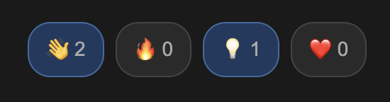

<h1 align="center">Pop</h1>
<p align="center">Lightweight, self-hosted emoji reaction widget for blogs.</p>

<p align="center">
  
</p>

<p align="center">
  <a href="https://pop.eisenschmidt.website/demo.html">Live Demo</a>
</p>

---

## Features

- Emoji reactions with toggle support
- Visitor counter with deduplication
- Silent mode (no UI, only data collection)
- Analytics dashboard
- Fully customizable styling via CSS
- Self-hosted with SQLite storage
- ~3KB minified frontend

## Structure

```
pop/
├── frontend/     # TypeScript widget
├── backend/      # PHP/Symfony API
└── dist/         # Build assets (demo.html, analytics.html, .env.example)
```

## Tech Stack

**Frontend**
- TypeScript
- esbuild
- Vitest

**Backend**
- PHP 8.4
- Symfony 8
- SQLite

## Requirements

- Node.js 18+
- PHP 8.4+
- Composer

## Development

```bash
make install   # Install dependencies
make test      # Run tests
make dist      # Build for production
```

## Demo

```bash
make demo
```

Opens http://localhost:8000/demo.html

## Deployment

1. Build the project:
   ```bash
   make dist
   ```

2. The `build/` directory is a complete, self-contained application:
   ```
   build/
   ├── public/           # Document root
   │   ├── index.php     # Symfony entry point
   │   ├── pop.min.js    # Widget script
   │   ├── pop.min.css   # Widget styles
   │   ├── demo.html     # Demo page
   │   └── analytics.html # Analytics dashboard
   ├── var/              # Database (must be writable)
   └── .env              # Configuration
   ```

3. Deploy `build/` to your PHP server with `public/` as document root.

4. Configure `build/.env`:
   ```bash
   APP_ENV=prod
   APP_SECRET=<random-string>
   POP_ALLOWED_DOMAINS=https://your-blog.com
   POP_DATABASE_PATH=var/data.db
   ```

5. Ensure `var/` directory is writable by the web server.

### Docker Compose

```yaml
services:
  pop:
    image: php:8.3-apache
    ports:
      - "8080:80"
    volumes:
      - ./build:/var/www/html
      - pop-data:/var/www/html/var
    environment:
      - APP_ENV=prod
      - APP_SECRET=change-me-to-random-string
      - POP_ALLOWED_DOMAINS=https://your-blog.com
      - POP_DATABASE_PATH=var/data.db
    command: >
      bash -c "a2enmod rewrite &&
               echo '<Directory /var/www/html/public>
                 AllowOverride All
                 Require all granted
               </Directory>' > /etc/apache2/conf-available/pop.conf &&
               a2enconf pop &&
               sed -i 's|/var/www/html|/var/www/html/public|g' /etc/apache2/sites-available/000-default.conf &&
               apache2-foreground"

volumes:
  pop-data:
```

Run with:
```bash
make dist
docker compose up -d
```

## Usage

### Full Widget (Reactions + Visitor Counter)

```html
<link rel="stylesheet" href="https://your-api.com/pop.min.css">
<div id="pop"></div>
<script src="https://your-api.com/pop.min.js"></script>
<script>
  Pop.init({
    el: '#pop',
    endpoint: 'https://your-api.com/api',
    pageId: 'unique-page-id',  // optional, defaults to current URL
    emojis: ['👍', '🔥', '💡', '❤️'],
    trackVisits: true,
    renderVisits: true,
    renderReactions: true
  });
</script>
```

### Reactions Only (No Visitor Counter)

```html
<div id="pop"></div>
<script src="https://your-api.com/pop.min.js"></script>
<script>
  Pop.init({
    el: '#pop',
    endpoint: 'https://your-api.com/api',
    emojis: ['👍', '🔥', '💡', '❤️'],
    trackVisits: true,
    renderReactions: true
  });
</script>
```

### Visitor Counter Only (No Reactions)

```html
<div id="pop"></div>
<script src="https://your-api.com/pop.min.js"></script>
<script>
  Pop.init({
    el: '#pop',
    endpoint: 'https://your-api.com/api',
    trackVisits: true,
    renderVisits: true
  });
</script>
```

### Silent Mode (Data Collection Only, No UI)

For recording visits without displaying anything:

```html
<script src="https://your-api.com/pop.min.js"></script>
<script>
  Pop.init({
    endpoint: 'https://your-api.com/api',
    trackVisits: true
  });
</script>
```

## Configuration Options

| Option | Type | Default | Description |
|--------|------|---------|-------------|
| `endpoint` | string | required | API endpoint URL |
| `pageId` | string | current URL | Unique identifier for the page |
| `el` | string | - | CSS selector for container (required if rendering) |
| `emojis` | string[] | `[]` | Array of emoji (required if `renderReactions`) |
| `trackVisits` | boolean | `false` | Record visits to the server |
| `renderVisits` | boolean | `false` | Show visitor counter (requires `el`) |
| `renderReactions` | boolean | `false` | Show reaction buttons (requires `el` + `emojis`) |

## API

### GET /api/reactions?pageId={id}

Returns reaction counts and current user's reactions.

```json
{
  "pageId": "my-page",
  "reactions": { "👍": 5, "🔥": 3 },
  "userReactions": ["👍"]
}
```

### POST /api/reactions

Toggles a reaction (adds if not present, removes if already added).

Request:
```json
{ "pageId": "my-page", "emoji": "👍" }
```

Response:
```json
{ "success": true, "action": "added", "count": 6 }
```

### GET /api/visits?pageId={id}

Returns visitor counts for a page.

```json
{
  "pageId": "my-page",
  "uniqueVisitors": 42,
  "totalVisits": 128
}
```

### POST /api/visits

Records a visit. Deduplicates by fingerprint within a configurable window (default: 30 minutes).

Request:
```json
{ "pageId": "my-page" }
```

Response:
```json
{ "success": true, "recorded": true, "uniqueVisitors": 43 }
```

### GET /api/stats

Returns aggregated statistics for all pages (used by analytics dashboard).

```json
{
  "global": {
    "uniqueVisitors": 1234,
    "totalVisits": 5678,
    "totalPages": 42
  },
  "pages": [
    { "pageId": "page-1", "uniqueVisitors": 100, "totalVisits": 250 },
    { "pageId": "page-2", "uniqueVisitors": 80, "totalVisits": 180 }
  ]
}
```

## Environment Variables

| Variable | Description |
|----------|-------------|
| `APP_SECRET` | Symfony secret key |
| `POP_ALLOWED_DOMAINS` | Comma-separated allowed origins |
| `POP_DATABASE_PATH` | Path to SQLite database file |
| `POP_VISIT_DEDUP_SECONDS` | Visit deduplication window in seconds (default: 1800) |

## Analytics

Access the analytics dashboard at `/analytics.html`. Enter your API endpoint to view visitor statistics across all pages.

## License

MIT
